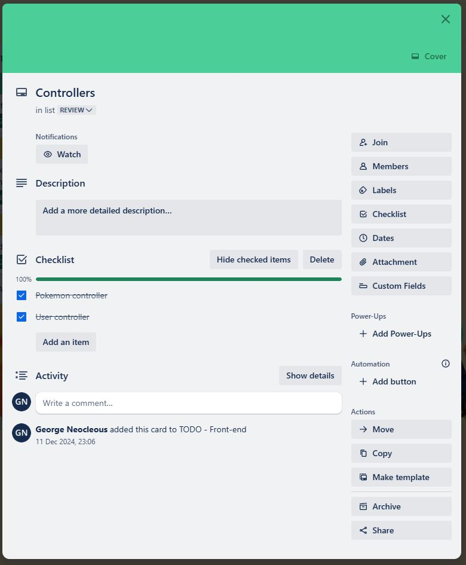
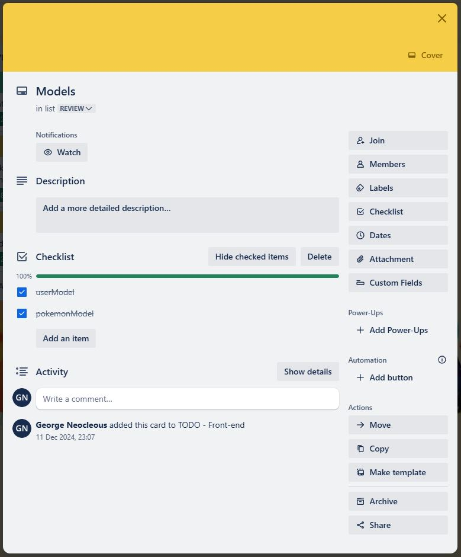

# pokeview-backend0
FUll-stack app part A: https://github.com/GeorgeNeocleous/t3a2-a-pokeview

## Backend
Github: https://github.com/GeorgeNeocleous/pokeview-backend0
Render: https://pokeview-backend0.onrender.com/

## Routes:

- "/signup"
    - POST
        - username
        - password
        - creates new user document in user collection
        - returns jwt

- "/login"
    - POST
        - username
        - password
        - checks username and password in user collection
        - returns jwt

- "users/:usersID"
    - GET
        - requires JWT header
        - gets one user and returns it

- "users/:usersID"
    - DELETE
        - gets one user and deletes it
        - returns deleted user information

- "pokemon/:usersID"
    - DELETE
        - gets one user and deletes it
        - returns deleted user information

- "/"
    - returns pokemon data for all 151 for the front-end to work with
        - GET
            - Name
            - Image
                - sprites.official-artwork.front_default
            - Pokedex number
            - Total like number
            - Stats

NOTE
Bruno: Need to create a new user using the User sign-up route in bruno. Then use the provided token for jwtAuth-test.

## Packages:

### "bcrypt": "^5.1.1" (Not in use - TODO)
- bcrypt is a package that was installed with the intention of using the hashing and salting functionality for additional user data security.
- Useful functionality would've been with their bcrypt.genSalt, bcrypt.hash and then bcrypt.compare.

### "cors": "^2.8.5"
- Is used to restrict what ports can request data from the server.
- cors code was commented out because I think it may have been restricting me in testing but I didn't have time to troubleshoot.

### "dotenv": "^16.4.7"
- Allows the app to use a dotenv file to store, abstract and use sensitive data from the .env file.

### "express": "^4.21.2"
- Manages the routes for the app.

### "helmet": "^8.0.0" (Not in use - TODO)
- A middeleware package that allows the addition of security-related HTTP headers. 

### "jsonwebtoken": "^9.0.2"
- Used to manage user authentication. Allows restriction of access to certain data based on a valid jwt.

### "mongoose": "^8.9.1
- Defines schemas and interacts with MongoDB.

## Trello / Source control & project management methodology
For this project I utilised Trello to try and implement a kanban methodology. Tasks were split and given colors based on perceived difficulty and effort needed. 
This project was attempted without a team and so I tried to gauge my own strengths and weaknesses. 
In general, I believe my strengths are more with the backend than the front end. Obviously this attempt has fallen short of the front-end requirement and an opportunity to assess this.

https://trello.com/b/AC33aLel/poke-view

- The (attempted) source control methodology was a Gitflow workflow. Where main was production code and from main there was a development branch. From development there were then feature branches to create new features in isolation and after completion were merged into development. With adequate new functionality and testing, these changes to development were then merged with main and represented a new production build.

Gitflow workflow: https://www.atlassian.com/git/tutorials/comparing-workflows/gitflow-workflow

- Green: because I didn't think this would take much effort relative to other tasks.

- Green: I feel as though this is a strength because to me this is very straight forward. It involves coupling functions together to ensure the routes make sense in function and purpose.

- Yellow: There was so much choice for the model structure that I wasn't sure what to go with. One of my current weaknesses is trying to figure out what direction I want to go, given the amount of freedom this project allowed.

- Yellow: I thought this wasn't too bad to setup. I like thinking of tests to create but I wasn't as familiar as I should be with the testing format or with what different things I can reasonably test.

- Yellow: This felt more complex due to the pokemon model, I got a little bit lost in what sort of functionality I needed. Then I ran out of time to implement the user CRUD. 

